# Mimir

Mimir is an all-in-one platform for fraud detection, compliance, expense intelligence, and reporting. The current deliverable is the Valsoft Fraud Hunter build: a reviewer-first fraud engine that ingests `transactions.csv`, scores every transaction, explains each flag, exports an updated CSV, and gives analysts a fast approve, dismiss, escalate, and undo workflow.

---

## Inspiration

The challenge brief asks for more than a high-scoring anomaly detector. It asks for a tool a human reviewer would actually want to use. That shaped Mimir around the trust and safety workflow: reduce 1,000 transactions to a small high-signal queue, show the evidence that caused each flag, preserve reviewer decisions, and keep the detection logic inspectable.

Mimir's broader product direction is the same idea applied across finance operations: connect messy transaction data, compliance requirements, reviewer judgment, and reporting into one system instead of separate tables, scripts, and manual notes.

## What it does

Mimir currently ships a Valsoft-focused fraud workflow:

- Ingests all 1,000 rows from `valsoft/data/transactions.csv`
- Builds per-card behavior baselines and cross-card aggregate signals
- Scores every transaction with a normalized risk score, level, primary pattern, and reason codes
- Flags the balanced top 8% review queue by default, currently 80 transactions
- Writes `valsoft/output/transactions_with_mimir_risk.csv` with fraud and Mimir risk columns added
- Writes `identified_fraud_transactions.csv`, `risk_results.json`, `review_queue.json`, `review_state.json`, and `audit_log.jsonl`
- Serves a local reviewer API for the dashboard and CLI
- Supports approve, dismiss, escalate, decline, block, and undo decisions
- Exposes card, merchant, device, IP, category-country cluster, timeline, and graph context

The active challenge docs are:

- [Mimir challenge README](mimir/README.md)
- [Valsoft docs index](valsoft/docs/README.md)
- [Valsoft PRD](valsoft/docs/VALSOFT_PRD.md)
- [Implementation plan](valsoft/docs/IMPLEMENTATION_PLAN.md)
- [Hypothesis log](valsoft/docs/HYPOTHESIS_LOG.md)

## How we built it

The detector is a transparent layered anomaly engine, not a single opaque model. Python handles CSV ingestion, feature engineering, scoring, JSON contracts, CLI commands, and the local API. Rust-backed packages provide graph and training primitives where the workflow benefits from reusable lower-level infrastructure.

```mermaid
flowchart LR
    accTitle: Mimir Fraud Flow
    accDescr: Mimir turns the challenge CSV into feature signals, risk scores, explainable review artifacts, and reviewer feedback that can update later scoring runs.

    csv([transactions.csv]) --> validate[Validate and normalize]
    validate --> features[Build feature layers]
    features --> score[Score and explain]
    score --> exports[Write CSV and JSON]
    exports --> api[Serve local API]
    api --> dashboard[Reviewer dashboard]
    dashboard --> feedback[Review state and audit log]
    feedback --> features
```



The main implementation lives in `mimir/src/mimir-fraud`. The dashboard lives in `mimir/apps/dashboard`. The Rust-backed packages used by the fraud engine are `mimir/packages/mimir-core`, `mimir/packages/xfraud-ml`, and `mimir/packages/synthetic-pipeline`.

## Challenges we ran into

The dataset has no public labels, so we could not tune against ground truth during development. We solved that by favoring explainable fraud hypotheses and by treating model outputs as supporting evidence rather than the sole reason for a flag.

Novelty was also noisy. A first-seen device, IP, or category can be legitimate, especially for small subscriptions and utilities. Mimir dampens benign novelty unless it combines with amount spikes, velocity, high-risk categories, or graph reuse.

The reviewer experience forced tradeoffs. A giant table is easy to build but weak for triage. The dashboard still supports tables and filters, but the challenge path is a strict review queue with keyboard actions and undo.

## Draft

The current demo run is reproducible from a clean local environment with Python 3.12, `uv`, `maturin`, and Bun. The balanced profile processes 1,000 transactions, flags 80, writes the required updated transaction file to `valsoft/output/transactions_with_mimir_risk.csv`, and writes the fraud ID list to `valsoft/output/identified_fraud_transactions.csv`.

Run the detector from the repository root:

```bash
.venv/bin/python -m mimir.cli score \
  --input valsoft/data/transactions.csv \
  --output-dir valsoft/output \
  --profile balanced
```

Start the local API:

```bash
.venv/bin/python -m mimir.cli serve --port 8787
```

Start the dashboard:

```bash
cd mimir
bun run dev:dashboard
```

Open `http://127.0.0.1:3001`.

## Accomplishments that we're proud of

Mimir covers the challenge requirements end to end: ingestion, scoring, explanations, reviewer workflow, updated CSV export, PRD, implementation plan, and tests. The reviewer path is stateful, undoable, and backed by an audit log instead of being a static ranked list.

The detection logic catches several fraud families with separate evidence paths: card testing velocity, high-value gift card and electronics cashout, merchant bursts across cards, shared device or IP reuse, and xFraud graph anomalies.

## What we learned

The strongest fraud signals came from combining local card behavior with cross-card context. Per-card baselines explain why a transaction is unusual for one cardholder; merchant, device, IP, and IP-prefix aggregation explain why a pattern is suspicious across the population.

We also learned that reviewer confidence depends on evidence density. A score is useful for sorting, but reviewers need concrete reasons, related transactions, and an audit trail before they can act quickly.

## What's next for mimir

Next, Mimir should persist reviewer decisions in SQLite or Postgres, tune thresholds against labeled review outcomes, add calibration for false discovery rate, and connect the synthetic transaction pipeline as a live feed. After the Valsoft fraud pass is stable, the same architecture can expand into Brim-style compliance, expense policy, reporting, and finance operations workflows.

## Repository layout

- `mimir/`: main application, dashboard, Python fraud package, and reusable packages
- `valsoft/`: consolidated challenge docs, dataset, and generated output artifacts
- `ref/`: reference implementations, research notes, and comparison material
