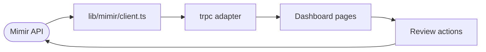

# Mimir Dashboard

The dashboard is the reviewer UI for the Valsoft Fraud Hunter build. It connects to the local `mimir-fraud` API, renders the strict review queue, and supports keyboard-driven approve, dismiss, escalate, and undo decisions.

---

## Role in the challenge

The challenge asks for a reviewer workflow, not just a static table. This dashboard provides:

- A command center summary of processed rows, flagged rows, risk distribution, and fraud patterns
- A strict pending review queue sorted by descending risk
- Transaction detail views with evidence, score, pattern, component scores, and xFraud score
- Keyboard navigation: arrow keys move between rows
- Keyboard review actions: `A` approve, `D` dismiss, `E` escalate, `U` undo
- Search and filters for investigation outside the strict review queue
- Audit and live feed surfaces for reviewer decisions

## Run locally

Start the fraud API from the repository root:

```bash
.venv/bin/python -m mimir.cli serve --port 8787
```

Start the dashboard from the Mimir workspace:

```bash
cd mimir
bun run dev:dashboard
```

Open `http://127.0.0.1:3001`.

The API base URL defaults to `http://127.0.0.1:8787`. Override it with `NEXT_PUBLIC_MIMIR_API_URL` or `MIMIR_API_URL`.

## Data path



## Key files

| File | Responsibility |
| --- | --- |
| `src/lib/mimir/client.ts` | Fetches Mimir API data and maps risk rows into dashboard transaction objects |
| `src/lib/mimir/types.ts` | Mimir transaction, reason, summary, and context types |
| `src/lib/mimir/trpc-adapter.ts` | Bridges existing dashboard TRPC calls to local Mimir functions |
| `src/app/[locale]/(app)/(sidebar)/page.tsx` | Fraud command center summary |
| `src/components/tables/transactions/data-table.tsx` | Review queue keyboard navigation and actions |
| `src/components/transaction-details.tsx` | Transaction detail and evidence panel |

## Verification

```bash
cd mimir
bun run lint --filter=@midday/dashboard
bun run build:dashboard
```
