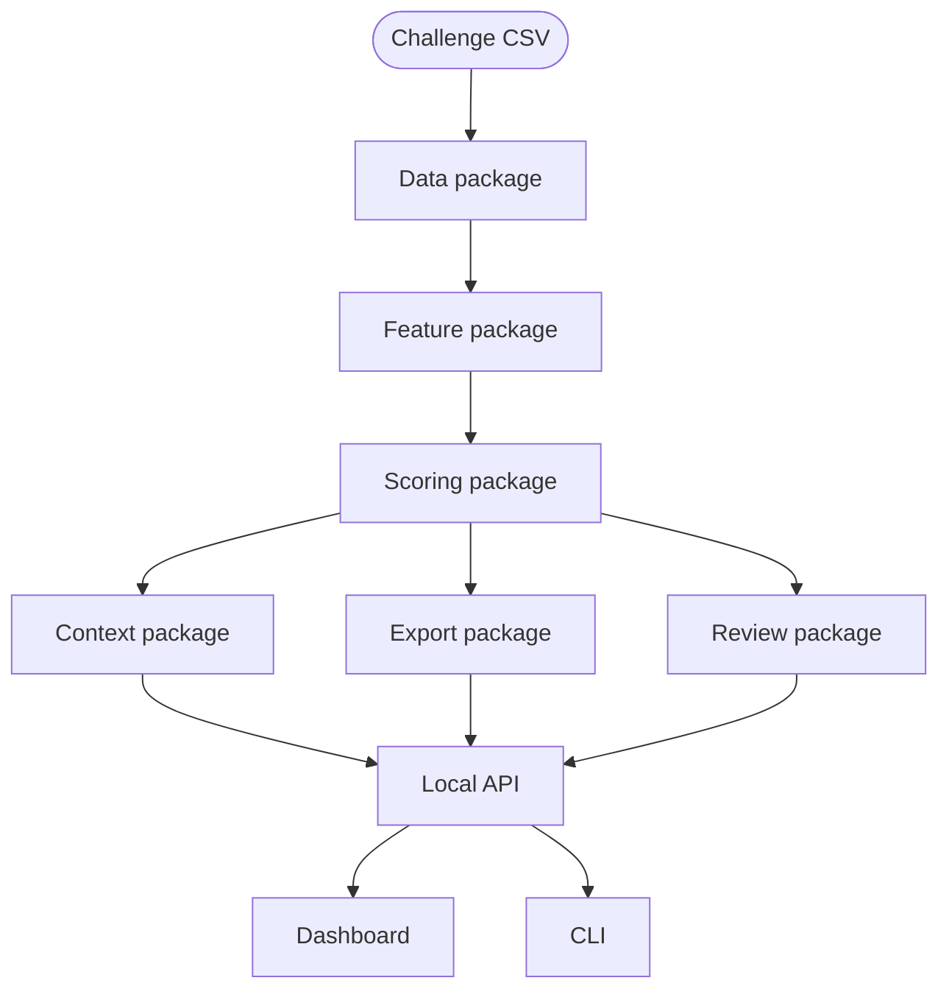

# Implementation Plan

This plan explains how Mimir satisfies the Valsoft challenge requirements and where the main engineering decisions live.

---

## Architecture



The active backend package is `mimir/src/mimir-fraud`. It exposes the import namespace `mimir.*` and keeps the challenge implementation isolated from the larger Mimir app until the fraud workflow is stable.

| Module | Responsibility |
| --- | --- |
| `core` | Shared schemas, constants, repository paths, and model version |
| `data` | CSV loading and validation of the Valsoft transaction contract |
| `features` | Per-card baselines, categorical surprisal, temporal velocity, graph/collective features, xFraud score, and model consensus |
| `scoring` | Component scores, final score, thresholds, risk levels, recommended actions, and reason generation |
| `context` | Entity summaries, card timelines, related transactions, and graph contracts |
| `review` | Review state, undo stack, audit log, session feedback, and xFraud training status |
| `export` | Updated transaction CSV plus frontend-ready JSON |
| `api` | Dependency-light local HTTP API |
| `cli.py` | Scoring, queue, next, context, review, undo, and serve commands |
| `primitives` | Adapters for Rust-backed packages |

The reviewer dashboard lives in `mimir/apps/dashboard`. It reuses the existing Next dashboard shell and maps the local Mimir API into the app's transaction abstractions.

## Tech choices

| Choice | Reason |
| --- | --- |
| Python 3.12 | Fast iteration for tabular fraud features, JSON contracts, and CLI/API glue |
| Polars | Reliable CSV ingestion, typed transforms, and output generation for 1,000-row challenge data |
| Pydantic | Stable contracts for risk rows, reasons, summary, review state, and API responses |
| Scikit-learn IsolationForest | Secondary consensus signal with deterministic percentile scoring |
| Python standard library HTTP server | Avoids adding FastAPI just for a local challenge API |
| Rust-backed `mimir-core` | Streaming transaction and graph primitives that can later support live ingestion |
| Rust-backed `xfraud-ml` | Graph training/scoring layer for transaction-entity relationships |
| Rust-backed `synthetic-pipeline` | Future live synthetic feed derived from the bundled transaction profile |
| Next dashboard with Bun | Reuses the Mimir dashboard shell and provides a reviewer-friendly UI |

## Build sequence

1. Load and validate `transactions.csv`.
2. Build robust per-card amount and behavior baselines.
3. Add categorical surprisal for rare card-conditioned merchant, category, device, IP, channel, and country behavior.
4. Add temporal windows for card testing, repeated high-risk activity, merchant bursts, split purchases, and near duplicates.
5. Stream rows through `mimir_core.TransactionProcessor` for graph and collective features.
6. Build xFraud graph edges over transaction, card, merchant, device, IP, and category-country entities.
7. Seed xFraud training with reviewer feedback where available, then high-confidence deterministic pseudo-labels.
8. Score every row with component weights and threshold by profile or cost.
9. Generate reason codes from exact feature evidence.
10. Export updated CSV and JSON review artifacts.
11. Serve local API endpoints for summary, queue, transactions, context, graph, review, undo, and audit.
12. Render the dashboard review path on top of the local API.

## Detection logic

The final risk score combines five component families:

| Component | Examples | Failure mode it catches |
| --- | --- | --- |
| `card_baseline` | Amount spike, new category, new merchant, new device, new IP, unusual country | Account takeover and sudden behavior shifts |
| `categorical_surprisal` | Smoothed rarity for card-conditioned categorical behavior | Rare combinations that are suspicious even when amount is moderate |
| `temporal_velocity` | 10-minute, 60-minute, 24-hour windows | Card testing, split purchases, repeated high-risk activity |
| `graph_collective` | Merchant burst, shared device/IP, IP-prefix reuse, rare clusters, xFraud score | Cross-card fraud that one-card features miss |
| `model_consensus` | IsolationForest percentile | Weak secondary corroboration |

The engine intentionally keeps deterministic reasons ahead of model-only signals. If xFraud contributes, the reason exposes the score, pseudo-label source, training seed count, validation AUC, and pseudo-label policy.

## Reviewer state and feedback

Review state is file-backed for the challenge:

| File | Purpose |
| --- | --- |
| `review_state.json` | Current status and undo stack |
| `audit_log.jsonl` | Append-only reviewer receipts |
| `transactions_with_mimir_risk.csv` | All original transactions with explicit fraud flag, pattern, reasons, and Mimir risk columns |
| `identified_fraud_transactions.csv` | Flagged transaction ID list with fraud pattern and reason codes |
| `review_queue.json` | Pending flagged rows for UI and demo |
| `risk_results.json` | Full summary plus all risk objects |

Reviewer feedback feeds the next run:

- Declined or blocked rows become positive pseudo-labels.
- Escalated rows become weak positive pseudo-labels.
- Approved and dismissed rows become negative pseudo-labels.
- Reviewer labels override heuristic pseudo-labels.
- Ambiguous rows are scored but excluded from xFraud training seeds.

## Work allocation

| Workstream | Owner role | Scope |
| --- | --- | --- |
| Detection | Risk engineer | Hypotheses, features, scoring, reasons, threshold profiles |
| Backend | Platform engineer | CLI, API, exports, schemas, review state, tests |
| UI | Product engineer | Dashboard review queue, keyboard actions, audit feed, filters |
| Documentation | Tech lead | README, PRD, implementation plan, hypothesis log |

## Skipped for now

| Skipped item | Reason |
| --- | --- |
| Fully supervised model | Hidden labels are unavailable during the challenge |
| Production database | JSON and JSONL are simpler, inspectable, and enough for a 24-hour demo |
| Authentication and RBAC | Not needed for a local judged workflow |
| Automatic card blocking | Human review is the required product path |
| Perfect score chasing | Over-flagging would hurt precision and reviewer trust |
| Brim compliance flows | Deferred until the fraud engine is stable |

## Verification

```bash
.venv/bin/python -m pytest mimir/src/mimir-fraud/tests
.venv/bin/python -m mimir.cli score --input valsoft/data/transactions.csv --output-dir valsoft/output --profile balanced
cd mimir && bun run lint --filter=@midday/dashboard
cd mimir && bun run build:dashboard
```
